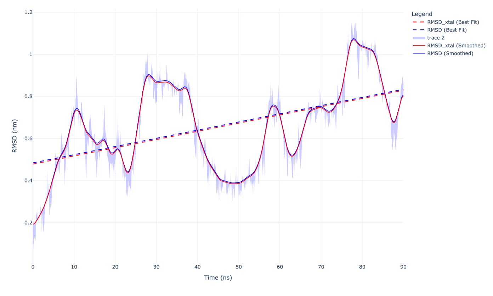
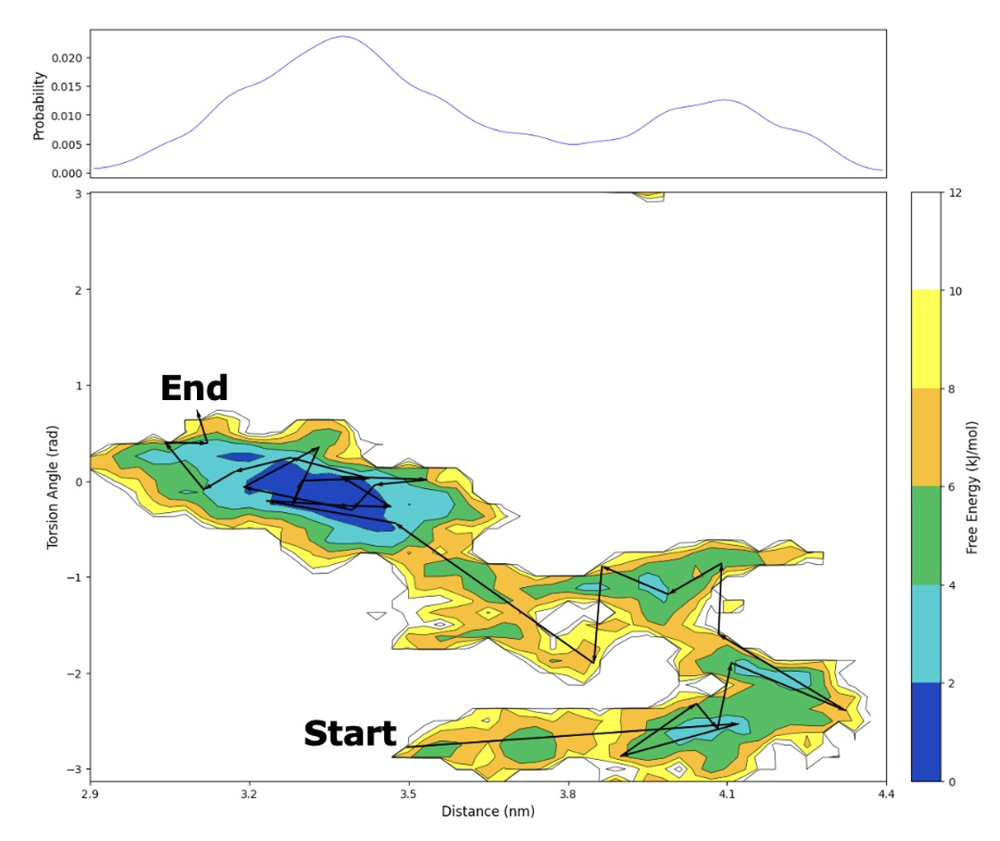
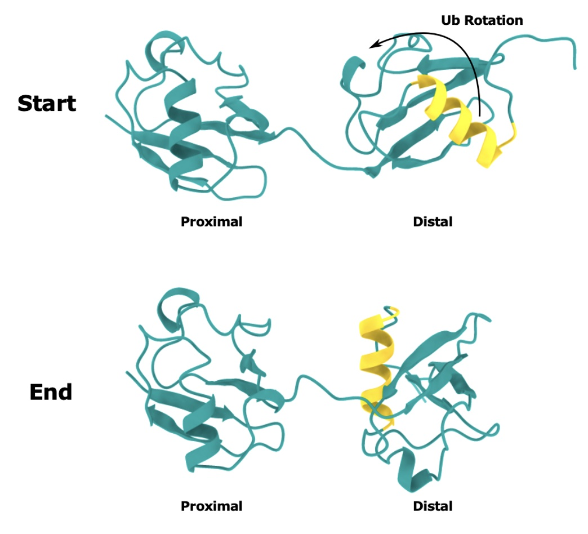

+++
author = "Nilton Aranda"
title = "Analysing Conformational States of Ubiquitin using MD Simulations"
date = "2025-03-11"
description = "Computational Research Project"
categories = [
    "Personal Research",
    "Molecular Dynamics",
]
tags = [
    "Free Energy Landscapes",
    "Structural Biology",
    "Ubiquitin"
]
image = "coms_ub.png"
math = true
draft = true
+++

<strong>Title Card:</strong> Calculating torsion angles based of Centres of Mass (COMs) of ubiquitin monomers. COM 1 (green) aa1-36; COM 2 (red) aa37-70; COM 3 (blue) aa77-113; COM 4 (orange) aa113-146.

## Introduction

Recently I have been quite interested in the conformational landscape that is possible with different ubiquitin chains and linkages. Naturally as an undergraduate student I don't have access to a lab to perform SAXS experiments for instance so I figured I should try to run some simulations instead. I'm not sure anything could prepared me for the torment of trying to compile or even use software packages with no programming experience at all.

## What are Molecular Dynamics (MD) Simulations?

Molecular Dynamics (MD) Simulations are

### Forcefields

> $$E\left(r^N\right) = E_{\text{bonds}} + E_{\text{angles}} + E_{\text{dihedrals}} + E_{\text{nonbonded}}$$
>
>$$E_{\text{bonds}} = \sum_{\text{bonds}} K_r (r - r_0)^2$$
>
>$$E_{\text{angles}} = \sum_{\text{angles}} k_\theta (\theta - \theta_0)^2$$
>
> $$E_{\text{dihedrals}} = \sum_{\text{dihedrals}} \left( \frac{V_1}{2} [1 + \cos(\phi - \phi_1)] + \frac{V_2}{2} [1 - \cos(2\phi - \phi_2)] + \frac{V_3}{2} [1 + \cos(3\phi - \phi_3)] + \frac{V_4}{2} [1 - \cos(4\phi - \phi_4)] \right)$$
>
> $$E_{\text{nonbonded}} = \sum_{i>j} f_{ij} \left( \frac{A_{ij}}{r_{ij}^{12}} - \frac{C_{ij}}{r_{ij}^6} + \frac{q_i q_j e^2}{4 \pi \epsilon_0 r_{ij}} \right)$$
>
> $$\text{with the combining rules} \quad A_{ij} = \sqrt{A_{ii} A_{jj}} \quad \text{and} \quad C_{ij} = \sqrt{C_{ii} C_{jj}}$$



